# AFK architecture implementation plan and evidence

Scope: zero manual calibration; one visible Roblox client; C#/WPF/OpenCvSharp; hardware input through the existing guarded coordinator. User explicitly permits interface adjustments in unattended operation. No release requested.

## Plan

1. Separate search location from observed control size. Use center/height anchored search regions, derive glyph bounds from native OpenCV contours and morphology, and normalize the observed shape against reviewed identity assets. Keep exact-match safeguards for quantity/filter identity and existing verified state transitions.
2. Require stable identity and location across fresh observations. Reacquire if a target moves before a click; reject ambiguous duplicates. Snap only inside the recognized glyph bounds, never toward arbitrary nearby color.
3. Keep Start persistent. Bound input bursts and use cooldowns, rather than terminating the request after a retry count or elapsed time. Preserve input-release, cancellation, no blind movement, and confirmed/unknown outcome semantics.
4. Recover missing-needle states early; require corroborating fish evidence on entry into reeling. Keep optional workflow cleanup separate from fishing; do not cast through an open aquarium panel.
5. Validate using both independent recorded PCs and generated combinations of viewport size, aspect ratio and independent UI scale. Require negative controls and full worker sequences through a confirmed catch. Run the complete regression suite and build a local candidate.

## Implemented

- ObservedGlyphMatcher measures connected glyphs in a bounded ROI. Candidate work is capped. Shape comparison includes correlation and bidirectional stroke coverage with a tolerance relative to glyph height. Its score is not a probability. Templates establish identity; viewport height no longer determines the only possible glyph size.
- Aquarium navigation, close, claim and balance observations try measured geometry first. Existing reviewed comparisons remain compatibility paths. Crate item/reward text uses the same measured path; exact crate search/filter identity retains its stricter comparison because 'crate' and 'crates' must remain distinct.
- VerifiedWorkflow requires a stable target location across observations and rejects a moved target immediately before action. Recognized glyph clicks use DynamicUISnap within isolated glyph bounds. Ambiguous aquarium glyph observations do not fall through to legacy matching.
- Three unsuccessful rod resets cause a 60-second cooldown and fresh gameplay checks, then another bounded attempt. Aquarium cleanup slows from 5-second intervals to 60-second intervals after six failures while blocking fishing inputs. Missing/loading gameplay no longer ends Start at five minutes. Ten minutes without a catch emits persistent diagnostic warnings, not a fabricated success or terminal stop.
- Scene changes permit a new bounded attempt only after cooldown, preserving the original scene reference and catch counters. Stop cancels waits immediately.
- AFK Start minimizes the macro dashboard so it cannot intercept game controls. It does not guess undocumented in-game visibility/settings shortcuts. Permission to simplify the game UI remains available when corresponding controls can be identified and their effects verified.
- Smoothing now uses native Filter2D rather than managed pixel loops. The known problematic GaussianBlur call path is not restored.
- Aquarium workflow evidence is also written into the session recorder, including match confidences.

## Limits and acceptance

Generated transformations test algorithmic invariance, not arbitrary Roblox updates, inaccessible controls, or independent physical-PC operation. The screenshot from the second PC is an independent source for navigation identity. Reconnect-to-fishing-position navigation is not implemented; recovery remains active and cannot assert productive fishing without a confirmed catch. No claim of overnight or all-PC acceptance will be made from replay counts. Full-suite and package results will be appended after validation completes.

## Recovery transitions

```mermaid
stateDiagram-v2
    [*] --> Fishing: Start
    Fishing --> Verify: reel or reward evidence
    Verify --> Fishing: confirmed result
    Verify --> Retry: missing needle / unconfirmed action
    Retry --> Fishing: verified rod reset and fresh cast
    Retry --> Cooldown: burst exhausted
    Cooldown --> Reacquire: cooldown elapsed
    Reacquire --> Fishing: gameplay verified; bounded cycle
    Reacquire --> Reacquire: loading / panel / missing client
    Fishing --> Stopped: Stop
    Verify --> Stopped: Stop
    Retry --> Stopped: Stop
    Cooldown --> Stopped: Stop
    Reacquire --> Stopped: Stop
```

A transition back to Fishing is permission for a bounded attempt, not a catch. Only independently observed catch evidence renews productive progress and updates the saved fishing view. Startup/configuration failures and unexpected unrecoverable errors can still report a stop; known gameplay interruptions remain persistent.

## Final validation

2026-09-30: the complete optimized Windows test suite passed 648 tests, failed 0, skipped 1 existing unavailable private-screenshot test (649 total), in 9m52s. Report: artifacts/architecture-results/architecture.trx. This includes 48 generated viewport/aspect/UI-scale combinations, measured-glyph positives/negatives, moved/ambiguous-target rejection, and full worker recovery/cancellation scenarios. Earlier terminal-stop assertions were updated to the user's persistent-Start requirement; input-release and no-blind-movement assertions remain.

The self-contained candidate publish succeeded. All 22 external workflow assets match source hashes. ZIP has 26 entries and no settings, recordings or logs. Candidate: artifacts/FischMacroCS-1.0.21-afkarchitecture.4-win-x64.zip. ZIP SHA256: 03F42029F813ADA7AAD6BC72597025A5CEA2A89C9485A05B2B28687CC2C0419A. Informational version 1.0.21-afkarchitecture.4 identifies the local candidate; no version bump, commit, tag or release was made. See included BUILD-INFO.json for executable and detection-source hashes. Live validation has not been performed on this candidate.
